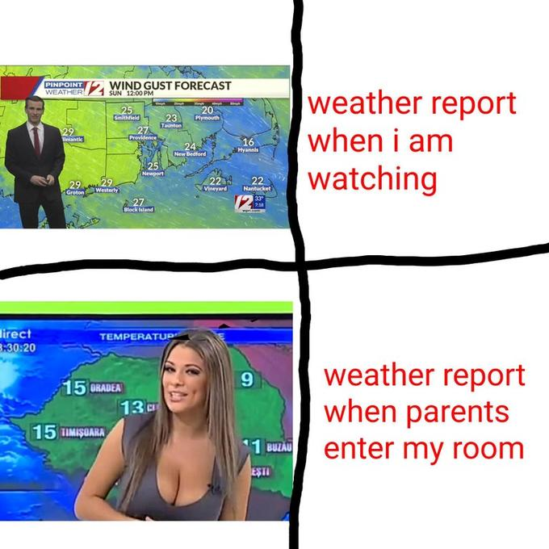

# Weather Forecaster

    

Humans have seen the sky and if it's getting cloudy, they think it's going to rain soon.
If clouds get sparser, we think it will be sunny tomorrow.

I want to try to apply this simple logic to trading.