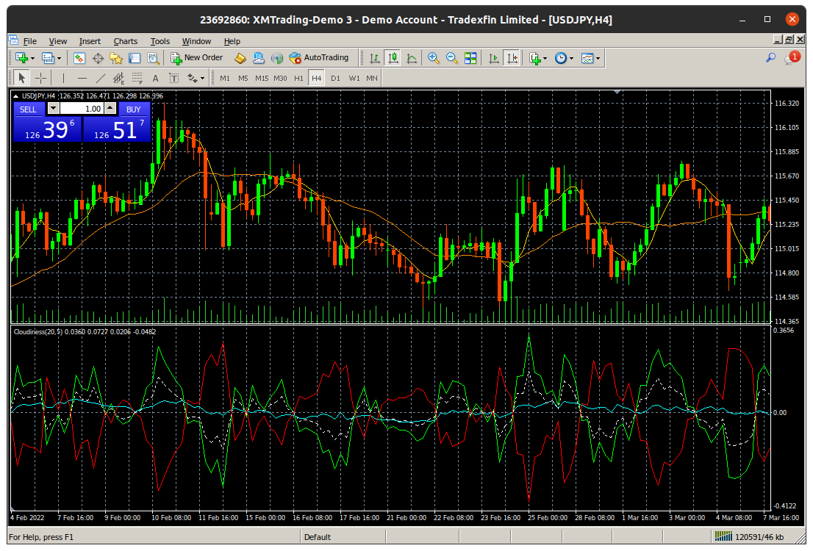

# Cloudiness

> **Cloud cover** (also known as **cloudiness**, **cloudage**, or **cloud amount**) refers to the fraction of the sky obscured by clouds when observed from a particular location.
> </br>
> [Cloud cover - Wikipedia](https://en.wikipedia.org/wiki/Cloud_cover)

> **雲量**（うんりょう、英: cloud cover）とは、空の全天に占める雲の割合である。
> </br>
> [雲量 - Wikipedia](https://ja.wikipedia.org/wiki/%E9%9B%B2%E9%87%8F)

----

# Development history

## 2022-04-04

- Version 0.0

```c
sky[i]        = close[i-1] - open[i-sky_window];
clouds[i]     = close[i] - open[i-clouds_window];
cloudiness[i] = clouds[i] / sky[i];
```

- The line doesn't appear when the timeframes shorter than D1.
- When `sky` is too small, `cloudiness` becomes very large.
  - How about calculating averages for `sky` and `clouds`?

## 2022-04-12

- version 1.0

### Definition

$$
    \mathrm{cloudiness} = \frac{\mathrm{clouds}}{\mathrm{sky} + \alpha}
$$

- $\alpha$: 値を調整するための定数
- clouds: 過去$N_{\mathrm{clouds}}$本分のロウソク足の実体の平均
- sky: 過去$N_{\mathrm{sky}}$本分のロウソク足の実体の平均

たとえば

$$
    \mathrm{sky} = \frac{1}{N_{\mathrm{sky}}} \sum_{\text{過去$N_{\mathrm{sky}}$本のロウソク足について}}(\mathrm{close}_{i} - \mathrm{open}_{i})
$$

### $\alpha$について

- $\alpha$は分母が小さくなりすぎないようにするためのパラメータ。
- これがないと、価格の変動が小さい時（すなわちskyの値が小さい時）cloudinessは極端に大きな値になってしまうことがあった。
- 値は大きすぎず小さすぎないのが良い。
  - 小さすぎるとcloudinessが極端に大きくなるし、大きすぎるとcloudinessはcloudsとほとんど同じになってしまい意味がない。
- 時間軸によって実体の大きさは変わるので、このパラメータの値は表示させる時間軸によって変えないといけない。
- このパラメータを導入したせいでcloudinessが正のときと負のときとで統一的に扱えない
- `cloudiness_p/n`みたなものを作ってもいいかもしれない。でも煩雑になるのは避けたい。

### インジケータの観察

<div align="center">
    
</div>

- $+ \alpha$のcloudinessを表示させると、トレンドの始まりと終わりでよく反応できていることがわかる。とくに終わりに関しては、従来の方法（移動平均線など）での判断ではおそすぎることなどが多いので、cloudinessが負に転じたら売り決済するなどすれば無駄な損失を防げそう。
- どれくらい敏感に反応させるかは、cloudsとskyの平均を取る期間を変更させれば良さそう。
- $\alpha$の値によってcloudinessを大きく小さくしたりできる。決済ラインなどはゼロでなくても、「ある負の値より小さくなったら」という条件のほうが、その次に継続して起こる上昇トレンドに乗りやすいかもしれない

<div align="center">
    
</div>

- `cloudiness_p`と`cloudiness_n`を分けてみたが、形状はゼロラインを軸としてほとんど同じになっている。ただ絶対値が違うので、使えるときが来るかもしれない。
    ```c
        cloudiness_p[i] = clouds[i] / (sky[i] + alpha);
        cloudiness_n[i] = clouds[i] / (sky[i] - alpha);
    ```
- いまは煩雑になって、赤いのがでかいと緑のがみにくくなるので、`cloudiness_p`（`cloudiness`）だけ表示させればいいかな